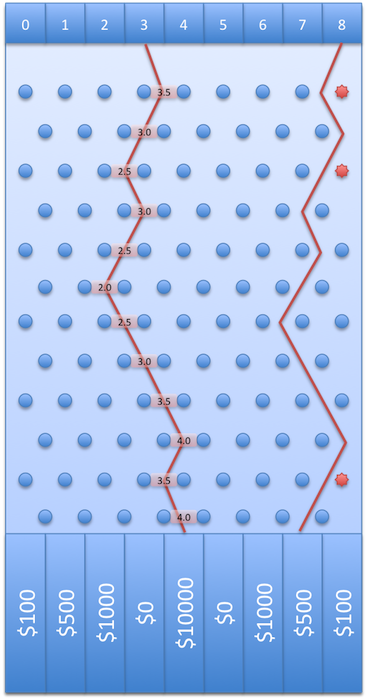

# Lab 4 - Plinko Simulator

## Synopsis

The Plinko Simulator simulates the game of Plinko, where you drop a token into a Plinko machine, and it drops into one
of various slots with various prizes. This program simulates the game, letting you drop in a single token at a time, or
many tokens at once. The single drop can tell you what path the token took and how much you won, while the multi-token
drop will tell you how much you won and the average winning per token. This lab was mostly for using if else statements,
loops, and pair programming.

### Background

Your best friend bought tickets for both of you to go to The Price Is Right this weekend. On the small chance that your
name gets called, you want to be ready to win as much money as possible. Instead of preparing for a wide variety of
games, though, you put all of your effort into the one game that truly matters: Plinko.

To practice your Plinko skills, you've decided to write a C++ program to simulate a game of Plinko and to compute
average winnings based on where you drop your chips.

If you are not familiar with Plinko, you may want to play it a bit before beginning the lab using an online version such
as http://www.kongregate.com/games/StapleGun/plinko. Note that the dimensions, prizes, or other details may be different
in the demo compared to the requirements of this lab. Use the values specified below, not those found in the demo.

### Requirements

* You may not use user-defined functions or arrays/vectors in this lab.
* You must develop Plinko in an Integrated Development Environment (IDE). Experiencing an IDE is one of the learning
  outcomes of this class, and is required for this lab. State in the Canvas submission quiz whether you exclusively used
  an IDE to develop this lab. We encourage you to use an IDE for developing the rest of the labs in this class.
    * We suggest using Visual Studio (VS) as your IDE, as this is what we know best. However, you may choose to use a
      different IDE such as xcode or repl. If you do choose a non-VS option, be aware that we may not be able to help
      you with issues specific to your IDE of choice, and that you are responsible for getting the IDE working.
* This lab must be completed using pair programming (exactly 2 people). Carefully read again the syllabus section on "
  Pair Programming" and the article "All I really need to know about pair programming I learned in kindergarten," so
  that you understand our expectations of what pair programming really means, and what you commit to by affirming in
  your Canvas submission quiz that you did use proper pair programming. Even though you are capable of doing this lab on
  your own, you are required to work on this lab as a pair.

* Your plinko board should be patterned after the image above. The image demonstrates the board, its slot numbers, its
  prizes, and two sample paths. This Plinko board consists of 9 input slots and 9 output slots. The money won for a chip
  is determined by the slot the chip falls into at the end as shown in the image (slot 0 yields $100, slot 2 yields
  $500, etc.)
* Between the input and output slots, there are 12 rows of pegs, with each row's pegs centered directly under the spaces
  from the row of pegs above as shown in the image. The left path displays the position of the chip at each step; the
  right path shows red pegs whenever the left (or right) decision is forced. For the left path in the example, the
  following is the expected path printout: [3.0 3.5 3.0 2.5 3.0 2.5 2.0 2.5 3.0 3.5 4.0 3.5 4.0]

### Part 1 - Prompt and Menu

A detailed example of all your operations is shown at the end of the specification. Begin your program with the output;
<pre>
Welcome to the Plinko simulator!  Enter 3 to see options.

Enter your selection now:
</pre>
If the user enters 3 then output the options menu:
<pre>
Menu: Please select one of the following options:

1 - Drop a single chip into one slot 
2 - Drop multiple chips into one slot 
3 - Show the options menu 
4 - Quit the program 
</pre>
After completing any option (except for quitting), re-prompt the user with "Enter your selection now: ". For Part 1,
only the quit and show options need to work.

If an incorrect option is entered, you must re-prompt the user to select another option. The user does not have to hit
3 (menu) first or at any time. They only need to hit 3 if they forgot the menu.

### Part 2 - Let the Chips Fall

* Allow the user to drop one chip into one slot
* Prompt the user to select a slot into which he or she will drop a chip
* If the specified slot is not in the range 0 to 8, notify the user and return to the original option prompt
* During simulation, report the path of the chip as it falls
* Report the amount of money won for the chip

### Part 3 - Bowl of Chips

* Allow the user to drop any number of chips into one slot
* Prompt the user to enter the number of chips to drop
* If the number of chips is non-positive (including 0), notify the user and return to the original option prompt
* Prompt the user to select one slot into which he or she will drop the chips
* If the specified slot is not in the range 0 to 8, notify the user and return to the original option prompt
* Report the total and average amount of money won for all chips rounded to the nearest penny
* Do NOT report the path of each chip as it falls down the Plinko board for the "Bowl of Chips" part

### Additional Requirements

* You must do this lab with pair programming.
* You must develop this lab exclusively in an IDE. While we encourage you to develop future main labs in an IDE, this is
  the only time you have to confirm it.

* You must use loops to fulfill lab functionalities.
* You must NOT use your own user-defined functions.
* You must NOT use arrays or vectors.
* Using constants instead of magic numbers is part of the suggested style but not in the Style Guide. However, in this
  lab you must use constants for what otherwise might look like magic numbers. An exception which we allow in this lab
  is that you may use the literal numbers 0 - 8 to choose the rewards for slots 0 - 8.

### Implementation

To ensure that your random path matches the auto-grader you MUST:

* Upon encountering a peg, a chip has a 50/50 chance of going left or right. Use "rand() % 2" to get a random value. If
  you get 0 decrease the chip position value, and if you get 1 increase the position value.
* Note that in some cases the direction is forced and no call to rand() is needed. For example, this happens when the
  chip is in position 0, since the chip can not move to -0.5, it must go to 0.5. Likewise, when in position 8, the chip
  can not go to position 8.5, so it must go to 7.5. In these cases you must NOT call rand(). Extra calls to rand() will
  get your program out of sync relative to what is required and cause your program to produce output that will not match
  the test files. Check first to see if you are in one of these edge cases and handle it appropriately. If not, then
  call rand() to get a random offset, as described above.
* You must set the random seed in the main function. Normally we would use "srand(time(0))" to get (
  more nearly) random behavior. However, in this lab you must use the same seed each time. Thus do srand(RANDOM_SEED)
  where the value of your constant is 42 and put the statement after your declarations and just when you start the main
  section of your code. Be aware that your random stream, even given a constant seed (e.g. 42), may be different on VS
  or other IDES compared to zyBooks.
    * When dropping a LARGE bowl of chips, the final average numbers should be close to the same regardless of the
      initial seed.
    * If the user gives invalid input, do not re-prompt for a good input; invalid input under any option should illicit
      a notification and return the user to the original option prompt. You may assume that the input will be an integer
      in all cases.

#### Sample Input

<pre>
-1
5
3
1
-1
1
9
1
5
2
-1
2
142
7
4
</pre>

#### Sample Output

Since we are now running in an IDE, we can see the input and output in a single stream. The test cases are still written
in terms of separate input and output, but this sample shows the operation as the program would appear running in an
IDE. Hint: To speed things up you can copy all or a beginning portion of the input box above. Then, when you execute
your program in your IDE, you can simply paste into the terminal window, and it will insert all these inputs as needed
into your running program. That saves the time of having to retype the inputs every time you run your program. We
recommend you put your own test cases in text files which you can similarly copy and paste to make testing and debugging
more efficient.

<pre>
Welcome to the Plinko simulator!  Enter 3 to see options.

Enter your selection now:
Invalid selection. Enter 3 to see options.

Enter your selection now:
Invalid selection. Enter 3 to see options.

Enter your selection now:
Menu: Please select one of the following options:

1 - Drop a single chip into one slot
2 - Drop multiple chips into one slot
3 - Show the options menu
4 - Quit the program

Enter your selection now:
*** Drop a single chip ***

Which slot do you want to drop the chip in (0-8)? Invalid slot.

Enter your selection now:
*** Drop a single chip ***

Which slot do you want to drop the chip in (0-8)? Invalid slot.

Enter your selection now:
*** Drop a single chip ***

Which slot do you want to drop the chip in (0-8)?
*** Dropping chip into slot 5 ***
Path: [5.0, 4.5, 4.0, 4.5, 5.0, 4.5, 4.0, 4.5, 4.0, 4.5, 5.0, 4.5, 5.0]
Winnings: $0.00

Enter your selection now:
*** Drop multiple chips ***

How many chips do you want to drop (>0)?
Invalid number of chips.

Enter your selection now:
*** Drop multiple chips ***

How many chips do you want to drop (>0)? 
Which slot do you want to drop the chip in (0-8)?
Total winnings on 142 chips:
$95800.00 Average winnings per chip: $674.65

Enter your selection now:
Goodbye!
</pre>
